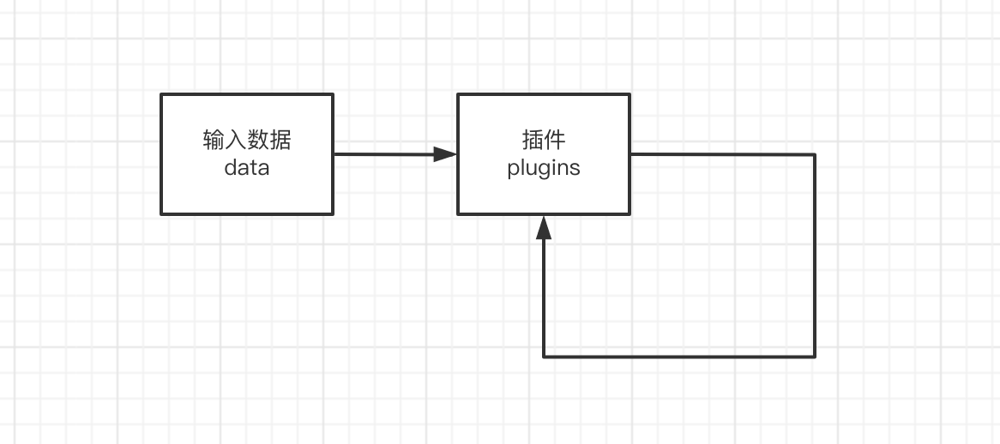
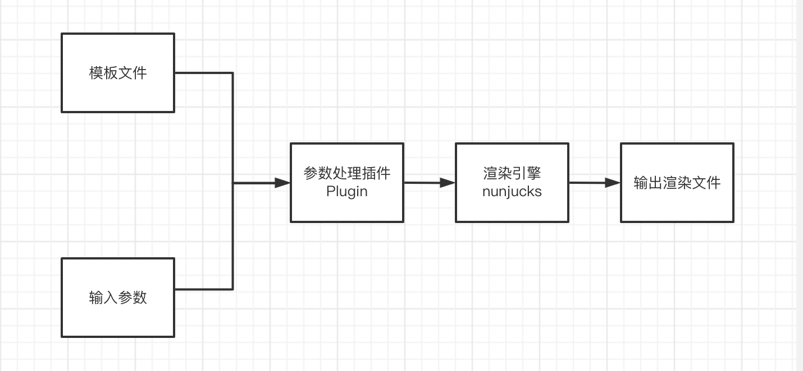

# more-copy.js V3.0


基于Node.js的数据处理的工具

利用more-copy，可以很容易实现一个类似VSCode、Pycharm、PHPStrom、Idea...中的代码片段，不过它依赖Node.js，而不依赖任何编辑器



- Home: [https://mouday.github.io/more-copy.js/](https://mouday.github.io/more-copy.js/)
- github: [https://github.com/mouday/more-copy.js](https://github.com/mouday/more-copy.js)
- npm: [https://www.npmjs.com/package/more-copy](https://www.npmjs.com/package/more-copy)

<!--  -->

简单的处理步骤：

- 输入数据 data
- 插件处理 plugins

## 安装

```bash
# 建议全局安装
npm i more-copy -g
```

## 命令行

```bash
$ mcp -h
Usage: mcp [options]

Options:
  -V, --version                            output the version number
  -h, --help                               display help for command
```

## 示例

一个简单的示例

```js
// more-copy.config.js
const ConsolePlugin = require("more-copy/plugins/console-plugin/index.js");
const TimePlugin = require("more-copy/plugins/time-plugin/index.js");

module.exports = {
  // 数据
  data: {
    name: "Tom",
  },

  // 使用插件，从上往下执行
  // 后面的插件，可以依赖前面插件的输出
  plugins: [
    new TimePlugin(), 
    new ConsolePlugin()
  ],
};

```

执行命令，运行 `more-copy`

```bash
$ mcp
{
  data: { name: 'Tom' },
  plugins: [ 
    TimePlugin { options: {} }, 
    ConsolePlugin { options: {} } ]
}

ConsolePlugin: {
  "name": "Tom",
  "time": {
    "now": "2022-11-08T11:08:40.349Z",
    "date": "2022-11-08",
    "time": "19:08:40",
    "datetime": "2022-11-08 19:08:40"
  }
}
```

## Plugin 插件

插件三要素：
- 参数：由`new Plugin(options)`传入，可以理解为插件的`配置`
- 依赖：由data对象提供，由前面的Plugin提供，可以理解为插件的`输入`
- 挂载：可以再全局的data对象上绑定数据，用于传递数据给后面的插件使用，可以理解为插件的`输出`


已实现的插件

|插件名称 | 配置 options | 输入data | 输出data | 说明 |
|- | - |  - | - | - |
[ConsolePlugin](plugins/console-plugin/README.md) | - | - | - | 用于输出当前data的值
[ReadFilePlugin](plugins/read-file-plugin/README.md) | filename：输入文件名 | - | content：文件内容 | 读取文件内容
[WriteFilePlugin](plugins/write-file-plugin/index.js)| filename：输出文件名<br />mkdir：创建文件夹 默认true<br />overwrite：是否覆盖已存在文件 默认false | content：输出的内容 | - | 输出文件
[TimePlugin](plugins/time-plugin/README.md)| - | - | time 时间对象 | 基于 dayjs 的时间插件 
[NunjucksPlugin](plugins/nunjucks-plugin/README.md) |-  | content：渲染前<br />data本身 | content：渲染后 | 模板渲染
[LaravelPlugin](plugins/laravel-plugin/README.md) | name | - | laravel | laravel使用
[ThinkphpPlugin](plugins/thinkphp-plugin/README.md) | name | - | laravel | Thinkphp各种类名
[TablePlugin](plugins/table-plugin/README.md) | table:表名<br />type_mapping: 类型映射<br />config:数据库配置| table | -  | 获取MySQL表字段

## 自定义插件

用户可以使用插件来处理输出

插件约定添加 data 对象上的属性，以插件名命名，特殊除外。

例如：

使用 `CustomPlugin` 将会添加属性`data.custom`

custom-plugin.js 用来处理模板入参，接口和此前版本略有不同

```js
const Plugin = require("more-copy/plugins/plugin.js");

// 继承基类
class CustomPlugin extends Plugin {
  process(data) {
    // 挂载自定义数据
    data.custom = {
      name: "Tom",
    };
  }
}

module.exports = CustomPlugin;
```

## 其他版本：

- [more-copy.js V2.0](README-2.0.md)
